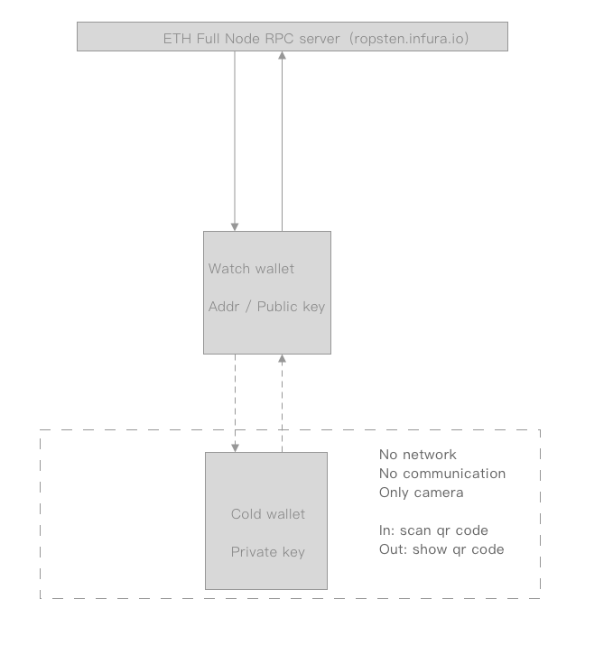

# ETH 多签 + 冷钱包 demo

基于Flutter + WalletCore.aar (后续开源源码)开发

**重要说明** 这个工程仅作为演示用，由于缺乏必要的安全策略，使用在生产环境您需要自行承担风险

## Update

**2019-09-20更新**WalletCore.aar 源码开源啦，在这里 https://github.com/lomocoin/wallet-core ，至此，这个工程所有源代码都开源了

暂时没有支持iOS,如果有需要的话可以提issue,我这边有空机会加上去。

## 目录说明
- prototype_draft 两个app的设计稿
- demo_watch 观察钱包源代码
- demo_cold 冷钱包源代码

## 演示录屏
https://www.bilibili.com/video/av64012728

## 试用

在release中下载apk,可以运行在一台安卓设备上（主要通过复制通信），也可以安装在2台设备上（通过扫码通信），体验完整功能流程如下：

1. 生成2个私钥,对应地址为 A1,A2
2. 将地址导入观察钱包，并查询余额
3. 从水龙头请求一些资金到地址A1,等待水龙头到账
4. A1有资金后可以创建多签合约
    - 收集地址(A1+A2)，构造交易
    - 签名交易，(用A1签名广播,A2没有支付手续费的资金)
    - 广播交易
    - 等待打包
    - 交易打包成功,读取多签合约地址,保存合约地址
    - 查询余额


5. 从A1转出资金到多签地址
    - 创建交易
    - 冷钱包签名
    - 广播交易
    - 等待打包
    - 查询余额，验证交易成功

6. 从多签地址转出全部资金到A2
    - 构造需要签名的转账信息（指定A1来广播交易，A2没有支付手续费的资金）
    - A1，A2 分别对转账信息进行签名
    - 收集成员签名(A1,A2),并构造需要广播的原始交易
    - A1 用冷钱包对原始交易进行签名
    - 观察钱包将交易进行广播
    - 等待打包
    - 打包成功，验证各地址余额

## 基本结构
基于 `ropsten.infura.io` api,一个冷钱包，一个观察钱包


多签流程:


## 开发人员运行app

如果可以，最好替换掉 infura.io 的 api url，有每日限额。

首先将 `WalletCore.aar` 拷贝到 `demo_code/android/app/libs/` 和 `demo_watch/android/app/libs/`目录下

```bash
cp WalletCore.aar  demo_cold/android/app/libs/
cp WalletCore.aar  demo_watch/android/app/libs/

#你需要确保本地flutter环境已安装 https://flutter.dev/docs/get-started/install

cd demo_cold && flutter run
cd demo_watch && flutter run

```

## app 打包

参见`demo_cold`和`demo_watch`的`Makefile`  ==> `make buildApk`

## ETH 多签合约

本demo中使用的多签合约 [`SimpleMultiSig.sol`](SimpleMultiSig.sol), 修改自 https://github.com/christianlundkvist/simple-multisig/blob/master/contracts/SimpleMultiSig.sol

## 其他

由于开发人员的一些设备坏了，扫码没有充分测试，有问题请提issue

有些私人数据，求忽略，求包含

## LICENCE

引用的资源基于引用资源本身协议

该工程基于 [WTFPL](http://www.wtfpl.net) 协议,大概就是，爱干嘛干嘛
